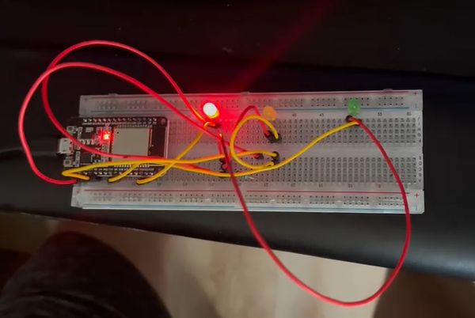

# IoT 001 - RC Led Alternator

### Project description
My first time working with Arduino. This project is a simple LED alternator that can be controlled remotely. The project uses an ESP32 microcontroller to control the LEDs and establish a communication link with a remote device over Wi-Fi. The remote control feature allows users to start and stop the LEDs wirelessly. It provides a convenient way to interact with the LED blinking process without the need for physical buttons or switches. The project is implemented using Arduino and ESP-IDF frameworks, making it easy to customize and extend the functionality according to specific requirements.

### Features
The project has the following features:
- Alternates between three LEDs at regular intervals.
- Uses an ESP32 microcontroller for LED control.
- Establishes a Wi-Fi connection to communicate with a remote device.
- Provides a web interface to control the LEDs remotely.

### How to use
To use this project, follow these steps:
- Install the Arduino IDE and ESP32 board support.
- Open the project in the Arduino IDE.
- Connect the ESP32 board to your computer using a USB cable.
- Select the correct board and port in the Arduino IDE.
- Enter the Wi-Fi credentials in the code.
- Upload the code to the ESP32 board.
- Open the serial monitor to view the IP address of the ESP32.
- Open a web browser and enter the IP address followed by /enable or /disable to control the LEDs.

### Materials
The project requires the following materials:
- ESP32 microcontroller board.
- Three LEDs.
- One resistor.
- Breadboard.
- Jumper wires.

